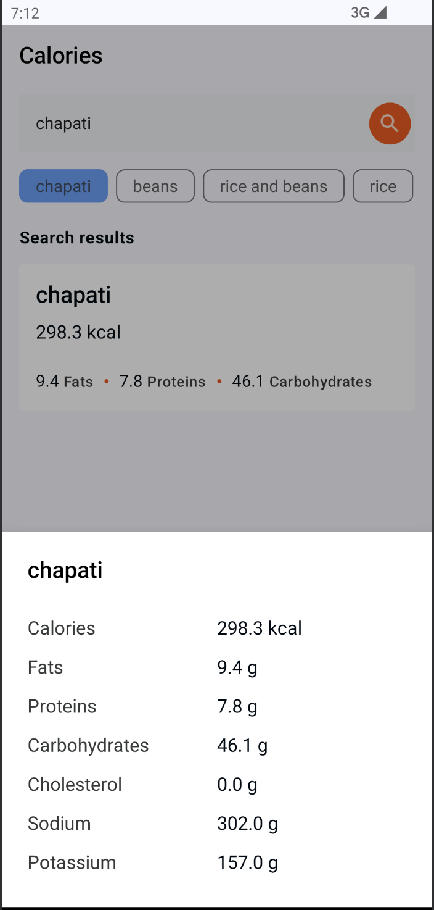

# Calories

A simple multimodule app that fetches Food composition details from [Calorie Ninja](https://calorieninjas.com/api) based on searches. 

### Features

As a user, I can

- Search for a food to see it's composition
- Click on the search results to see more details

# Designs

|                Initial Idle state                      |               Idle state with recent searches               |  
|:------------------------------------------------------:|:-----------------------------------------------------------:|
|  |    |

|                     Search Results                     |                       Food details                        |  
|:------------------------------------------------------:|:---------------------------------------------------------:|
|  |  |

|                     Error State                        |                                No Results Found                                            |
|:------------------------------------------------------:|:-------------------------------------------------------------------------------------------|
|  |   |

### Packaging Structure

- `core`
    - `data`
        - aggregates the data from the network and local database
    - `domain`
        - handles business logic 
    - `local`
        - handles local caching
    - `remote`
        - Fetches data from remote sources 
    - `testing`
        - Has utility classes used for testing
    - `ui`
        - Has the app theming 
- `feature`
    - `calories`
       - handles searching and displaying of the food composition
    - `food details`
       - Displays the more food composition details 

# Tests

The app includes both unit and instrumented tests.

### Core

#### data

|                                CalorieRepositoryTests                                 |
|:-------------------------------------------------------------------------------------:|
|  |

#### Remote

|                                 CaloriesSearchApiTest                                  |
|:--------------------------------------------------------------------------------------:|
|  |

### Presentation

#### Calories ViewModel

|                                   CaloriesScreenViewModelTest                                   |
|:-----------------------------------------------------------------------------------------------:|
|  |

#### Calories Screen

|                                   CaloriesScreenTest                                   |
|:--------------------------------------------------------------------------------------:|
|  |

